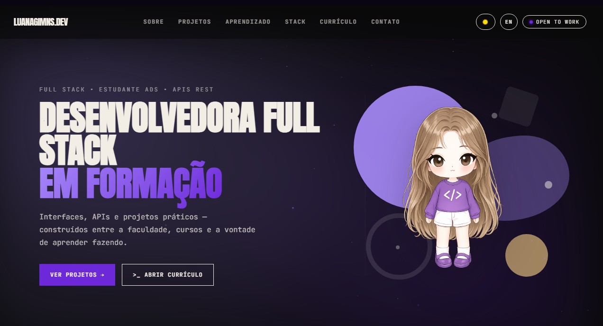

# Luana % Dev Log

Portfólio pessoal — onde front-end e back-end se encontram.

> ⚠️ Projeto em desenvolvimento contínuo. Novas seções, ajustes e melhorias são adicionados aos poucos através de commits.

<!--  -->

## ✨ Seções

- **Hero** — apresentação e status
- **Sobre** — quem sou, foco de estudo e estatísticas rápidas
- **Projetos** — projetos práticos filtráveis por categoria (WEB / TOOL)
- **Aprendizado** — cursos e ferramentas do dia a dia
- **Stack** — linguagens, frameworks e nível de domínio autoavaliado
- **Jornada** — trajetória até aqui, com currículo em PDF
- **Contato** — envio de e-mail direto, com cópia do endereço como fallback

Extras: tema claro/escuro, tradução PT/EN, terminal interativo (command palette) e animações de scroll.

## 🛠️ Stack

HTML5 · CSS3 · JavaScript · TypeScript · Angular · Node.js · PHP · Python

## 🚀 Rodando localmente

Não tem build nem dependências — é só abrir o `index.html` no navegador.

```bash
git clone https://github.com/luanagimns/portfolio.git
cd portfolio
start index.html   # ou: open index.html (macOS) / xdg-open index.html (Linux)
```

## 📬 Contato

- ✉ [byluanagimenes@gmail.com](mailto:byluanagimenes@gmail.com)
- 🐙 [github.com/luanagimns](https://github.com/luanagimns)
- 💼 [linkedin.com/in/luanagimns](https://www.linkedin.com/in/luanagimns/)
